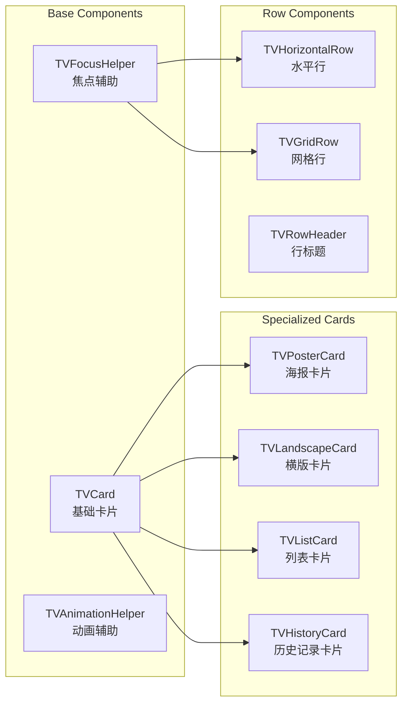
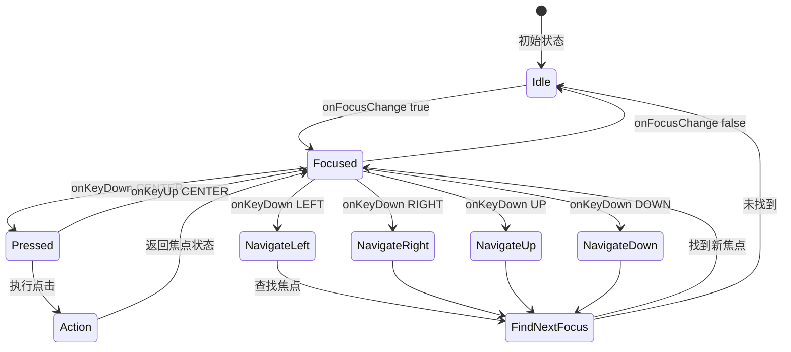
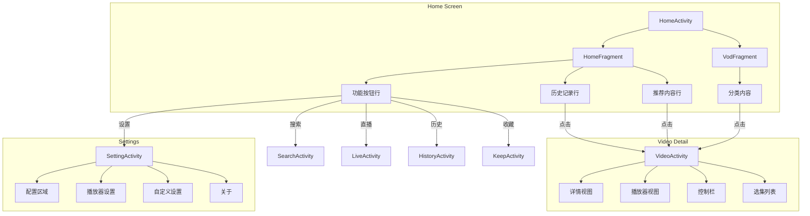

# Leanback UI 架构设计

## 整体架构图

```mermaid
graph TB
    subgraph Design System
        DS[设计系统] --> Colors[colors.xml<br/>颜色系统]
        DS --> Dimens[dimens.xml<br/>尺寸系统]
        DS --> Styles[styles_tv.xml<br/>样式主题]
        DS --> Animations[动画资源]
        DS --> Drawables[Drawable资源]
    end

    subgraph Component Library
        CL[组件库] --> Cards[卡片组件]
        CL --> Rows[行组件]
        CL --> Dialogs[对话框组件]
        CL --> Navigation[导航组件]
        
        Cards --> TVCard[TVCard]
        Cards --> TVPosterCard[TVPosterCard]
        Cards --> TVLandscapeCard[TVLandscapeCard]
        
        Rows --> TVHorizontalRow[TVHorizontalRow]
        Rows --> TVGridRow[TVGridRow]
        
        Navigation --> TVTopBar[TVTopBar]
        Navigation --> TVTabRow[TVTabRow]
    end

    subgraph Pages
        P[页面层] --> Home[HomeActivity]
        P --> Video[VideoActivity]
        P --> Live[LiveActivity]
        P --> Settings[SettingActivity]
        P --> Search[SearchActivity]
        P --> History[HistoryActivity]
    end

    Design System --> Component Library
    Component Library --> Pages
```

## 组件层级结构



## 焦点管理流程



## 页面导航流程



## 设计 Token 系统

### 颜色 Token

| Token 名称 | 用途 | 值 |
|------------|------|-----|
| `tv_focus_primary` | 主焦点色 | #00A3FF |
| `tv_focus_ring` | 焦点光环 | #4000A3FF |
| `tv_surface_card` | 卡片背景 | #1A1A1A |
| `tv_surface_card_focused` | 焦点卡片背景 | #2A2A2A |
| `tv_text_primary` | 主文字 | #FFFFFF |
| `tv_text_secondary` | 次要文字 | #B3FFFFFF |

### 尺寸 Token

| Token 名称 | 用途 | 值 |
|------------|------|-----|
| `tv_overscan_horizontal` | 水平安全边距 | 48dp |
| `tv_overscan_vertical` | 垂直安全边距 | 27dp |
| `tv_focus_scale` | 焦点缩放比例 | 1.05 |
| `tv_card_corner` | 卡片圆角 | 8dp |
| `tv_card_spacing` | 卡片间距 | 16dp |
| `tv_text_title` | 标题字号 | 24sp |
| `tv_text_body` | 正文字号 | 16sp |

### 动画 Token

| Token 名称 | 用途 | 值 |
|------------|------|-----|
| `tv_anim_duration_fast` | 快速动画 | 150ms |
| `tv_anim_duration_normal` | 普通动画 | 200ms |
| `tv_anim_duration_slow` | 慢速动画 | 300ms |
| `tv_anim_interpolator` | 动画插值器 | fast_out_slow_in |

## 组件 API 设计

### TVCard

```java
public class TVCard extends FrameLayout {
    // 属性
    private int cornerRadius;
    private boolean showFocusRing;
    private float focusScale;
    
    // 方法
    public void setImage(String url);
    public void setTitle(String title);
    public void setSubtitle(String subtitle);
    public void setBadge(String badge);
    public void setProgress(float progress); // 0-1
    
    // 焦点回调
    public interface OnFocusChangeListener {
        void onFocusChange(boolean hasFocus);
    }
}
```

### TVHorizontalRow

```java
public class TVHorizontalRow extends RecyclerView {
    // 属性
    private String title;
    private boolean showMoreButton;
    
    // 方法
    public void setAdapter(TVRowAdapter adapter);
    public void setTitle(String title);
    public void setOnMoreClickListener(OnClickListener listener);
    
    // 焦点管理
    public void requestFocusOnFirstItem();
    public void scrollToPosition(int position, boolean animate);
}
```

## 文件组织结构

```
app/src/leanback/
├── java/com/fongmi/android/tv/
│   ├── ui/
│   │   ├── activity/          # Activity 类
│   │   ├── fragment/          # Fragment 类
│   │   ├── adapter/           # Adapter 类
│   │   ├── presenter/         # Leanback Presenter
│   │   ├── dialog/            # 对话框
│   │   ├── widget/            # 自定义组件 (新增/重构)
│   │   │   ├── card/          # 卡片组件
│   │   │   │   ├── TVCard.java
│   │   │   │   ├── TVPosterCard.java
│   │   │   │   └── TVLandscapeCard.java
│   │   │   ├── row/           # 行组件
│   │   │   │   ├── TVHorizontalRow.java
│   │   │   │   └── TVGridRow.java
│   │   │   ├── nav/           # 导航组件
│   │   │   │   ├── TVTopBar.java
│   │   │   │   └── TVTabRow.java
│   │   │   └── focus/         # 焦点辅助
│   │   │       ├── TVFocusHelper.java
│   │   │       └── TVFocusAnimator.java
│   │   ├── holder/            # ViewHolder
│   │   ├── base/              # 基类
│   │   └── custom/            # 现有自定义组件
│   └── utils/
│       └── TVAnimationUtils.java  # 动画工具类
│
├── res/
│   ├── values/
│   │   ├── colors.xml         # 颜色 (更新)
│   │   ├── colors_tv.xml      # TV 专用颜色 (新增)
│   │   ├── dimens.xml         # 尺寸 (更新)
│   │   ├── dimens_tv.xml      # TV 专用尺寸 (新增)
│   │   ├── styles.xml         # 通用样式
│   │   └── styles_tv.xml      # TV 专用样式 (新增)
│   ├── animator/
│   │   ├── tv_card_state.xml      # 卡片状态动画
│   │   ├── tv_focus_scale.xml     # 焦点缩放
│   │   └── tv_button_state.xml    # 按钮状态动画
│   ├── drawable/
│   │   ├── tv_card_background.xml     # 卡片背景
│   │   ├── tv_button_background.xml   # 按钮背景
│   │   ├── tv_focus_ring.xml          # 焦点光环
│   │   └── tv_gradient_scrim.xml      # 渐变遮罩
│   └── layout/
│       ├── widget_tv_card.xml         # 卡片布局
│       ├── widget_tv_poster_card.xml  # 海报卡片
│       ├── widget_tv_row.xml          # 行布局
│       └── ... (页面布局更新)
```

## 迁移策略

### 渐进式迁移

1. **新旧共存**: 新组件与旧组件并行存在
2. **逐页迁移**: 一个页面一个页面地迁移
3. **保持兼容**: 确保现有功能不受影响

### 迁移顺序

```
1. 设计系统资源 (colors, dimens, styles)
   ↓
2. 基础组件 (TVCard, TVFocusHelper)
   ↓
3. HomeActivity/HomeFragment
   ↓
4. VideoActivity
   ↓
5. 其他页面
   ↓
6. 清理旧代码
```

## 性能考虑

### 优化策略

1. **RecyclerView 优化**
   - 使用 `setHasFixedSize(true)`
   - 合理设置 `setItemViewCacheSize()`
   - 使用 `DiffUtil` 进行数据更新

2. **图片加载优化**
   - 配置 Glide 缓存策略
   - 使用适当的图片尺寸
   - 预加载可见区域外的图片

3. **动画性能**
   - 使用硬件加速
   - 避免在动画期间创建对象
   - 使用 `ObjectAnimator` 代替 `ValueAnimator`

4. **焦点性能**
   - 缓存焦点查找结果
   - 避免频繁的布局更新
   - 使用 `postponeEnterTransition()` 优化过渡

## 测试清单

### 功能测试
- [ ] 所有页面的导航流程
- [ ] 焦点在所有组件间的移动
- [ ] 返回键行为
- [ ] 菜单键行为

### 视觉测试
- [ ] 焦点状态显示正确
- [ ] 动画流畅无卡顿
- [ ] 文字清晰可读
- [ ] 颜色对比度足够

### 设备测试
- [ ] 1080p 电视
- [ ] 4K 电视
- [ ] Android TV 机顶盒
- [ ] Fire TV 设备

---

此架构设计文档将作为整个重构项目的技术参考。